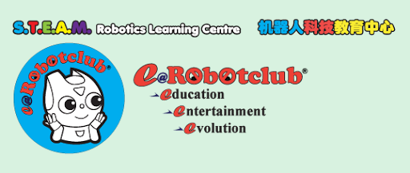

<p align="center">
  
</p>

# Ollo R Block Assistant

A plugin for Claude Code and OpenAI Codex CLI that helps kids (roughly age 10 to 17) write and debug programs for ROBOTIS R+ Ollo robots in the R Block app.

It exists because generic AI coding assistants will happily hand a kid Python when they're working in R Block, and Python doesn't translate to the visual blocks. Students get stuck, get frustrated, and stop. This plugin teaches the AI to use the exact R Block wording instead, walk through the program one piece at a time, and explain what each block does as they place it.

## What you get

- A skill that triggers on Ollo, R Block, R+ robot, ROBOTIS, or OlloBot keywords. Works in English, Malay, and Chinese. Block code stays in English regardless of conversation language (the R Block app only renders English).
- A `/ollo` slash command for Claude Code if you want to invoke it explicitly.
- The full block reference for all categories (Control, Calculation, Variable, Function, Sensing, Motion, Screen, Sound, Line) loaded on demand.

## Install

### Claude Code

```
/plugin marketplace add GenAIMakeEasy/ollo-r-block-assistant
/plugin install ollo-r-block-assistant
```

### Codex CLI

```bash
npx codex-marketplace add GenAIMakeEasy/ollo-r-block-assistant --plugins
```

Note the plural `--plugins` flag. You'll be asked to install at project scope (just the current repo) or global scope (all projects). Pick global to keep it always on. The TUI route also works: run `codex`, then `/plugins`, switch to the marketplace tab, and install from there.

### Manual

Clone the repo, copy the skill into the right directory:

```bash
git clone https://github.com/GenAIMakeEasy/ollo-r-block-assistant.git
```

For Claude Code:
```bash
cp -r ollo-r-block-assistant/skills/ollo-r-block-assistant ~/.claude/skills/
cp ollo-r-block-assistant/commands/ollo.md ~/.claude/commands/
```

For Codex CLI, project-scoped:
```bash
mkdir -p .agents/skills
cp -r ollo-r-block-assistant/skills/ollo-r-block-assistant .agents/skills/
```

Or user-scoped:
```bash
mkdir -p ~/.codex/skills
cp -r ollo-r-block-assistant/skills/ollo-r-block-assistant ~/.codex/skills/
```

On Windows, swap `~/` for `C:\Users\<you>\`.

## How it behaves

Two modes, picked automatically from how the student opens the chat.

**Build mode.** If the student wants to make something new ("I want my robot to follow a line and stop at a crossroad"), the assistant proposes the program flow in plain language first and waits for the student to confirm before placing any blocks. Once confirmed, it builds in phases, two or three blocks at a time, and waits between phases. No full-program dumps.

**Debug mode.** If something's broken ("my robot just spins"), the assistant reads the student's blocks, finds the bug, explains the cause in one or two sentences, and shows the corrected snippet. Direct, not Socratic. Kids who are stuck don't need riddles.

Block lines come out tagged with the tab they live in, with bold for dropdown options, italic for variable names, and monospace for literal values:

> `[Motion]` Move robot's **Back axis** **Forward** at speed `50`
> `[Control]` Wait until \[ **No.1** IR sensor value **>** `300` \]

So a student can scan a line and see at a glance: which parts are pickable options, which they typed in, which are the variables they named.


**More examples**

Student: give program to let the robot t move along the square track in one round as in image shown.

___________________________________________________________________________________________________________________________________

___________________________________________________________________________________________________________________________________

___________________________________________________________________________________________________________________________________

___________________________________________________________________________________________________________________________________


## Languages

English, Bahasa Malaysia, or Chinese (Simplified or Traditional). The assistant matches whatever the student writes in first, including mixed-language messages (common in Malaysia: "tolong help saya code ni"). Jargon like *sensor*, *threshold*, *variable* gets defined in both languages on first use, so kids pick up the English terms they'll see in tutorials and screenshots.

The R Block code itself never gets translated. The robot's app only knows the English block names, so translating them would just mean the student can't find the blocks.

## Contributing

PRs welcome, especially for:

- Blocks or syntax patterns I missed
- New debug heuristics
- Translations of the skill prose into other languages

## License

MIT. See [LICENSE](LICENSE).

## Acknowledgments

ROBOTIS for the Ollo R+ kits and the R Block app. Anthropic and OpenAI for the plugin systems this rides on.
